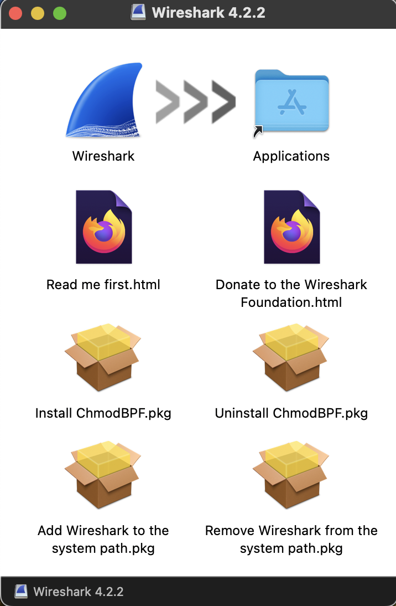
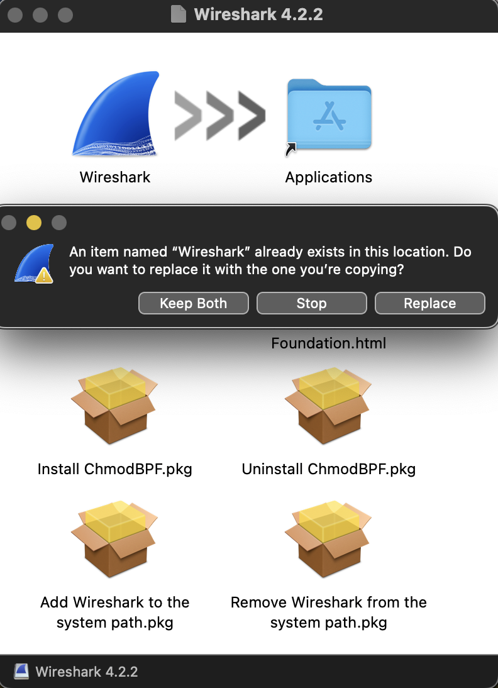
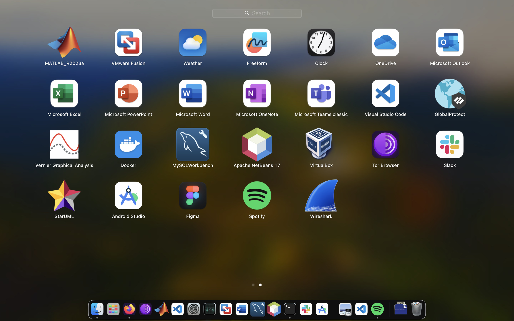
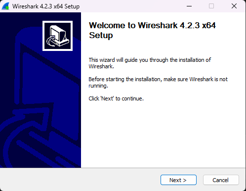
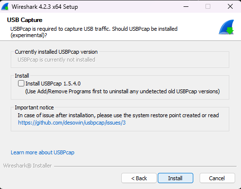
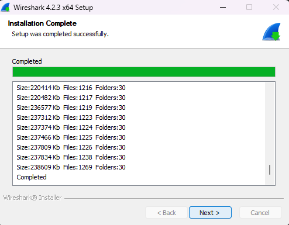
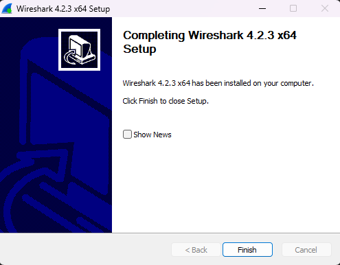

# MacOS App Installation
by Adrian Valencia on May 14, 2024

After years of loyal devotion to Windows, I found myself at a crossroads, yearning for a more **seamless** computing that would allow me to program and do my schoolwork more **efficiently** on a laptop with a good battery life.

Thus, I decided to realm into Apple's territory for the first time. I had heard a lot of exciting things about their Mac M1 series laptop that utilized ARM architecture to be incredibly **efficient** with performance and battery life.

Navigating through the MacOS environment, I found myself pleasantly surprised by the refreshing visuals and responsiveness of the computer. There was a sense of excitement learning something new and seeing how things differed from one platform to another. However, installing external applications by far was one of the most **inefficient** experiences ever.

When in this menu, my **mental model** for this installation process matched the **conceptual model** that I had from my previous installation experiences. Here you can see, the file works just like it does on Windows if the package is a disk image file (dmg) which prompts you with their version of an installation wizard.

Now, being greeted with this menu, I was unsure of what to do or what was even going on. After observing the icons and trying to move things around, I managed to drag and drop the Wireshark icon into the Applications folder. The issue is, after performing this action, there is absolutely no **feedback** to indicate that you did anything or that the app is installing.

So naturally, I tried it again to see if the first time I accidentally missed dropping the Icon directly into the folder. Then this appears, which I took as an indicator that somehow the application was installed. So I press stop, I exit the installation wizard, and head over to my system application.

As you can see in my system applications, the last application listed is now Wireshark. Hooray, my application installed! Nonetheless, the experience behind installing an application on Mac was awful as it provided no **feedback** and misled me into thinking applications took longer than they did to install when in reality they install in mere seconds. During the installation of Wireshark, I sat at my laptop for 10 minutes waiting for feedback assuming it was a heavy application like Matlabs so I thought it was possible for it to take many minutes.

Here you can see the installer is just like MacOS, an executable file that launchers the installation wizard when double clicked.

This is the installation wizard for all file formats whether an executable or a disk image, they all get installed through this wizard.

On this menu, I can see a clear indicator for the process required to install something. I simply follow the prompt and click 'Next' for each prompt in the installation wizard.

In this menu, aftering accepting the license agreement and specifying the default path where the program resides, I get the final 'Install' button which clearly indicates this will create the program on my computer.

After pressing install, there is clear **feedback** that shows me the files being written to the disk and the green progress bar that fills up as the installation progresses.

Thus, this image shows that our installation was successful and has a clear 'Finish' button to exit the installation wizard with no doubts about our installation progress being halted or unsuccessful.

Consequently, when it comes to how **satisfying** it is to use the Macbook, it's a bittersweet experience. On one hand, there's a brand new user interface that has a notable level of sophistication in aesthetic design and good performance. While on the other hand, app installations and your ability to find system files or application data files to modify config files, MacOS can be super tricky to work with.
